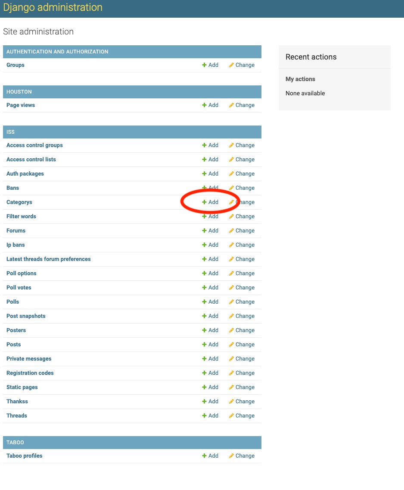

# Setting up ISS on Heroku

Heroku is the quickest way to get an ISS instance up and running, and it's free! This doc will walk you through the process of setting up ISS on Heroku and some of the first step you'll want to take as a new admin. The deploy script is written in bash and assumes you have git and standard POSIX utils installed, it should run on OSX and any normal desktop flavor of linux. You may be able to run it on windows with bash, but you'll have to install the Heroku CLI yourself from [here](https://devcenter.heroku.com/articles/heroku-cli).

Before you begin, you'll to sign up for a heroku account (free tier works find) which you can do [here](https://signup.heroku.com/). Also ensure git is installed, a tutorial for installing it if you don't already have it can be found [here](https://www.atlassian.com/git/tutorials/install-git).

## Setup

First clone the ISS repository

```
$ git clone https://github.com/Lanny/ISS.git
```

Then run the deploy script:

```
$ cd ISS
$ ./heroku-deploy.sh setup
```

If you don't have the Heroku CLI installed the script will attempt to install it for you. It will prompt you to log in with Heroku, then create an app and install ISS on it. Finally it will prompt you for a username/email/password which will be used to create an admin user account on your freshly created instance.

You can re-run the setup script at any time, however it will destroy any existing ISS instance tied to your repo including the database. To update while keeping your database intact, see the updates section below.

When the script finishes it will output a URL which leads to your freshly created ISS instance.

## First Steps

The first thing you'll want to do is create subforums for your instance so users can post. To do this visit the `/admin` URL for your instance, or click the "Admin" link in the user controls section at the top of every page when you're logged in as an admin (the account you created during setup). This admin page links you to several important tools for administrating your ISS instance.

From the admin page, click the "Add" link in the "Categories" row to add a new forum category:



Categories are collections of forums that are logically groups together and shown together on the homepage. You must have at least one category for forums to be in, although it's very common to have separate categories for "on topic" and "general/social". You can split up your subforums however you like. On this page give your category a name. The "priority" field determines the order that categories are listed in, with lower numbers being listed first. You can leave this field as is. Click "Save" in the bottom right when you're done.

Next, return to the admin page and click the "Add" link in the Forums row. For the category field, select the category you just created. Fill out the name and description fields. The remaining fields can be left as is, priority is the same as before but works to sort forums within categories. Again, click "save" when you're done.

Now revisit the home page of your ISS instance. You should see your new forum and category, and should be able to create threads therein.

### Trash Forums

You may have noticed an "is trash" toggle on the forum add page. If a forum is marked as a trash forum, it will be used to move posts that you flag as trash to. This is useful for keeping threads on topic and combatting spam, and is generally preferable to deleting content outright. It's recommended that you have exactly one forum designated as a trash forum.

### Configuration

ISS has a number of configuration settings you can adjust to your liking. The first one you'll probably want to change is the internal forum name, used in page titles, navigation, some messaging, and emails. To change a setting, use the `iss_set_config` subcommand of `heroku-deploy.sh` like so:

```
$ ./heroku-deploy.sh iss_set_config forum_name "\"Lannys Fresh Forum\""
```

Note the `\"`s around the value. ISS config settings are python expressions, so strings need to be wrapped in quotes. While this can be a bit cumbersome for strings, it allows you to use richer python data types in your settings, e.g.:

```
$ ./heroku-deploy.sh iss_set_config invite_expiration_time "datetime.timedelta(days=7)"
```

For a more complete list of settings that ISS recognizes, see the [DEVNOTES](../docs/DEVNOTES.md).

## Email

_Coming soon_

## Help, I'm being spammed!

_Coming soon_


## Updates

_Coming soon_

## Problems, questions, troubleshooting

If you find a bug, have a question, or generally need help with running an ISS instance, feel free to open a ticket in the [GitHub issue tracker](https://github.com/Lanny/ISS/issues). If you run into an issue and are able to resolve it independently, but found the documentation was unclear or missing, you're highly encouraged to open an issue or pull request to improve it. All feedback is appreciated.
